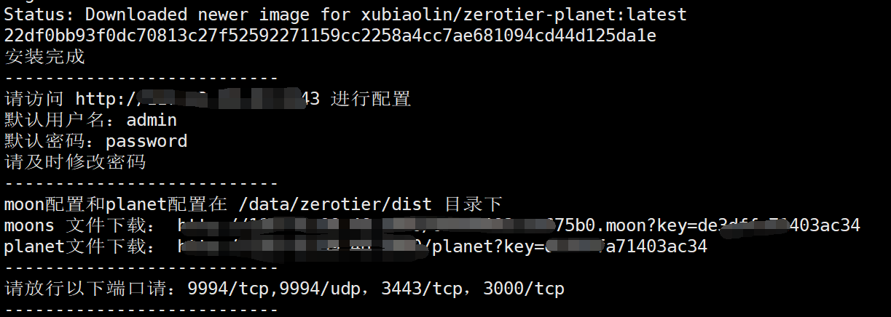
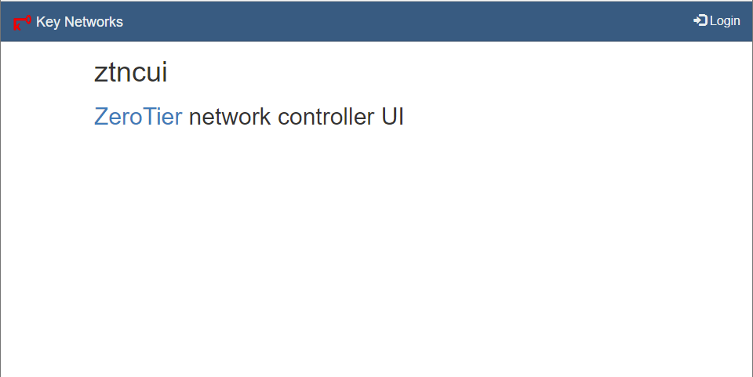
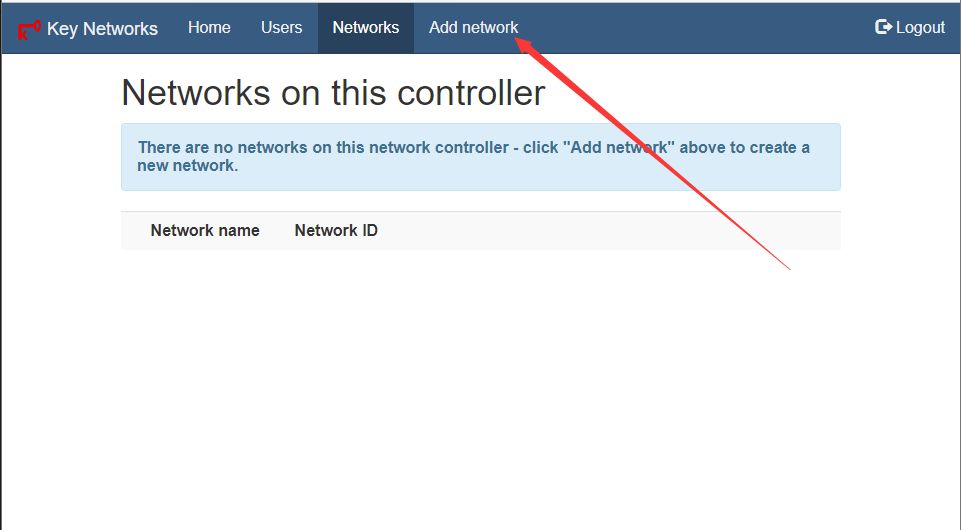
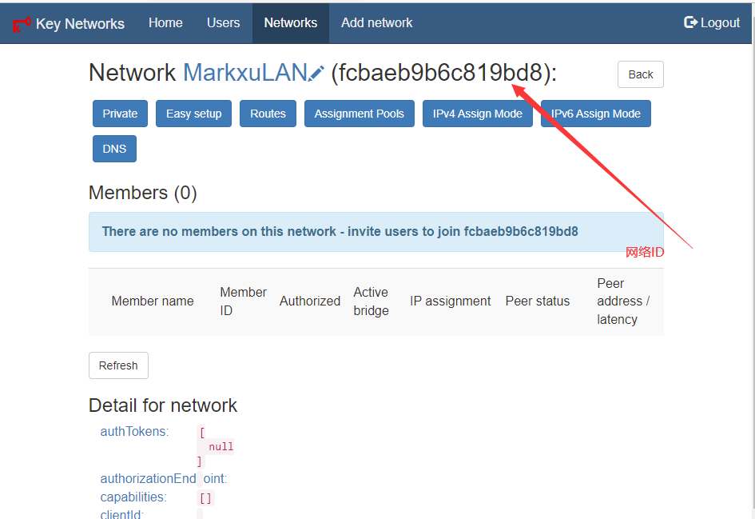
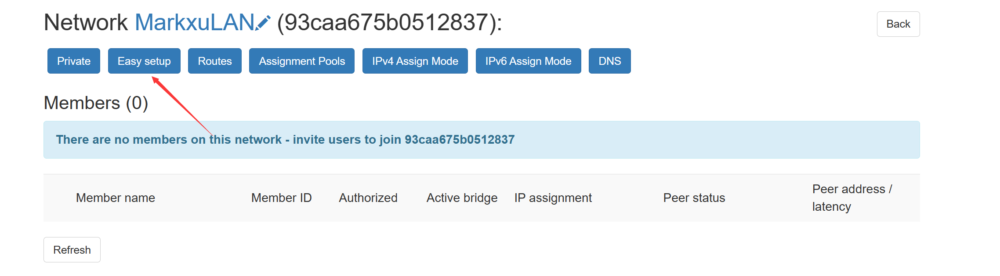
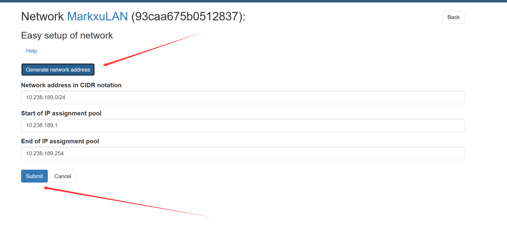
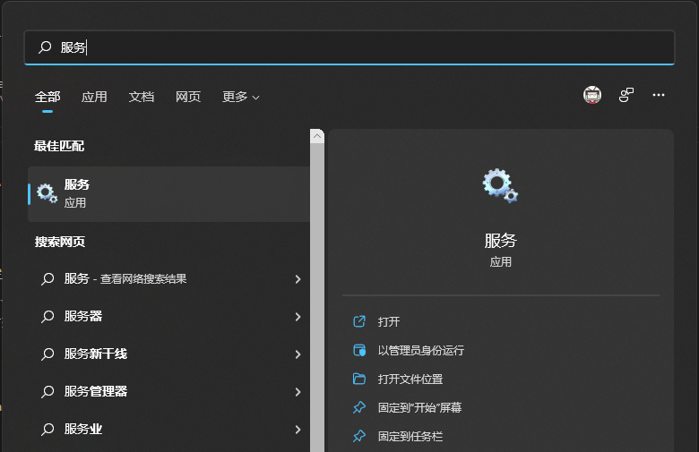
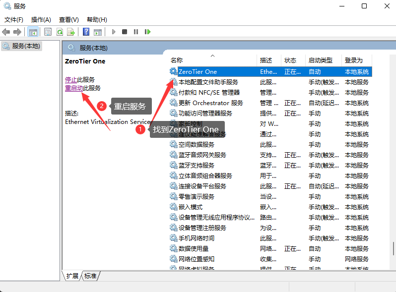
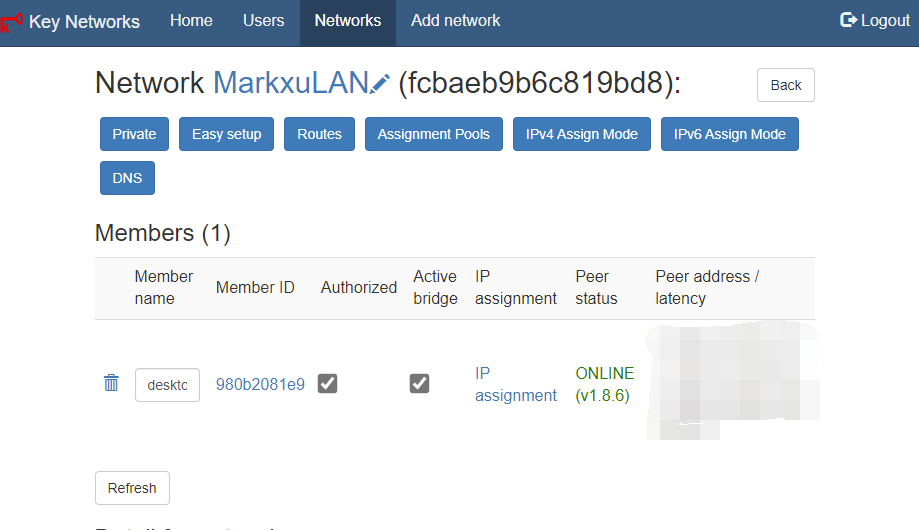
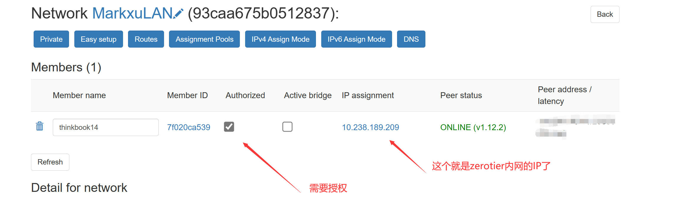

# 功能特性
- ✅ 支援 Linux/AMD64、Linux/ARM64 架構
- 🐳 Docker 容器化部署
- 📥 支援 URL 下載 planet、moon 配置
- 🌐 可作為 Moon 或 Planet 伺服器搭建

# 1：ZeroTier 介紹

`ZeroTier` 是一款強大的 P2P VPN 工具，它能讓你在網路上建立屬於自己的虛擬區域網路。透過它，你可以輕鬆實現遠端存取家中設備的需求 - 例如在公司用手機直接存取家中的 NAS。最重要的是，設備之間是點對點直連的，無需經過中轉伺服器，既保證了速度，又提升了安全性。

它的工作原理是這樣的：透過 `ZeroTier One` 用戶端，在不同裝置（如筆記型電腦、手機、伺服器等）之間建立 P2P 連接，即使這些裝置都在 NAT 後面也沒問題。它使用了 STUN 等技術，可以穿透大多數類型的 NAT，實現設備間的直接通訊。如果實在無法直連，才會透過中轉伺服器進行通訊。

簡單來說，`ZeroTier` 就像是一個跨越互聯網的"虛擬交換機"，讓分佈在世界各地的設備，都能像在同一個區域網路內一樣方便地相互訪問。

**ZeroTier 網路中的關鍵概念**

`PLANET`（行星伺服器）：ZeroTier 網路的核心根伺服器，負責網路發現和初始連線。相當於整個網路的"中樞"。

`MOON`（衛星伺服器）：使用者可以自建的私有根伺服器。它可以作為區域性的代理節點,幫助就近的設備更快地建立連接,提升網路效能。

`LEAF`（葉子節點）：所有連接 ZeroTier 網路的終端設備,如電腦、手機、伺服器等。這些設備透過 PLANET 和 MOON 的協調來相互發現和通訊。

本教學將引導您建立一個私有的 PLANET 伺服器,讓您完全掌控自己的 ZeroTier 網路。


# 2：為什麼要自建PLANET 伺服器
自建 PLANET 伺服器有以下幾個重要原因：

1. 提升網路穩定性：官方伺服器位於海外，國內用戶存取延遲高且不穩定。自建伺服器可以大幅提升連線品質。

2. 加快連線速度：在地化的 PLANET 伺服器可以更快地幫助裝置建立 P2P 連線。

3. 增強網路控制：自建伺服器讓您完全掌控網路配置，並可依需求進行最佳化調整。

4. 提高安全性：私有化部署意味著網路流量不經過第三方伺服器，更加安全可靠。

5. 降低依賴：避免因官方伺服器故障或網路波動影響您的業務正常運作。


# 3：開始安裝
## 3.1：環境準備
在開始安裝之前，請確保您的伺服器符合以下條件:

- 伺服器需求:
 - 擁有公網IP位址
 - 需開放以下連接埠:
   - 3443/tcp (管理面板，依實際情況調整)
   - 9994/tcp (ZeroTier通信，依實際情況調整)
   - 9994/udp (ZeroTier通信，依實際情況調整)

- 軟體依賴:
 - Docker (容器運行環境)
 - Git (取得項目代碼)

- 系統需求:
 - 推薦使用較新的Linux發行版:  
  - Debian 12
  - Ubuntu 20.04+
  - Rocky Linux
  - 其他同類系統

### 3.1.1 安裝git
```bash
#debian/ubuntu等
apt update && apt install git -y

#centos等
yum update && yum install git -y
```

### 3.1.2 安裝docker
```bash
curl -fsSL https://get.docker.com |bash
```

如果網路問題，導致無法安裝，可以使用國內鏡像安裝：
請參考：[安裝Docker](https://help.aliyun.com/zh/ecs/use-cases/install-and-use-docker#33f11a5f1800n)

### 3.1.3 啟動docker
```bash
service docker start
```

### 3.1.4 配置docker加速映像（可選，不配也可以）
```
sudo tee /etc/docker/daemon.json <<EOF
{
 "registry-mirrors": [
 "https://docker.mirrors.aster.edu.pl",
 "https://docker.mirrors.imoyuapp.win"
 ]
}
EOF

sudo systemctl daemon-reload
sudo systemctl restart docker
```

## 3.2：下載專案原始碼
官方地址
```
git clone https://github.com/xubiaolin/docker-zerotier-planet.git
```

加速位址
```
git clone https://ghproxy.imoyuapp.win/https://github.com/xubiaolin/docker-zerotier-planet.git
```

## 3.3：執行安裝腳本
進入專案目錄
```
cd docker-zerotier-planet
```

執行 `deploy.sh` 腳本
```
./deploy.sh
```

根據提示來選擇即可，操作完成後會自動部署
```
歡迎使用zerotier-planet腳本，請選擇需要執行的動作：
1. 安裝
2. 卸載
3. 更新
4. 查看訊息
5. 退出
請輸入數字：
```

整個腳本預計需要 1-3 分鐘,具體需要看網路與機型


當您看到類似如下字樣時，表示安裝成功




## 3.4 下載 `planet` 文件
腳本執行完成後，會在 `./data/zerotier/dist` 目錄下產生 `planet` 和 `moon` 設定檔。

您可以透過以下兩種方式取得這些文件:

1. 安裝完成後提供的URL直接下載
2. 使用scp或其他檔案傳輸工具從伺服器下載

請妥善保存這些文件,後續配置客戶端時會用到。

## 3.5 新建網絡
造訪 `http://ip:3443` 進入controller頁面



使用預設帳號為:`admin`

預設密碼為:`password`

### 3.5.1 建立網絡
登入後點選"Networks"選單，然後點選"Add Network"按鈕建立新網路。

在建立網路頁面中，輸入一個方便識別的網路名稱，其他選項可保持預設。點擊"Create Network"按鈕完成建立。

建立成功後系統會自動產生一個網路ID，這個ID在後續客戶端設定時會用到，請記錄下來。



得到網路 `id`



### 3.5.2 分配網路IP:
選取easy setup


產生ip範圍


# 4.客戶端配置
ZeroTier 支援多種主流作業系統的客戶端，包括:
- Windows
- macOS
- Linux
- Android

## 4.1 Windows 配置
首先去zerotier官網下載zerotier客戶端

將 `planet` 檔案覆蓋貼到`C:\ProgramData\ZeroTier\One`(這個目錄是個隱藏目錄，需要運允許查看隱藏目錄才行)

Win+S 搜尋 `服務`



找到ZeroTier One，並且重啟服務




### 4.2 加入網絡
使用管理員身分開啟PowerShell

執行以下指令，看到join ok字樣就成功了
```
PS C:\Windows\system32> zerotier-cli.bat join 網路id(就是在網頁裡面建立的那個網路)
200 join OK
PS C:\Windows\system32>
```

登入管理後台可以看到有個新的客戶端，勾選`Authorized`就行



IP assignment 裡面會出現zerotier的內網ip



執行如下命令：
```
PS C:\Windows\system32> zerotier-cli.bat peers
200 peers
<ztaddr> <ver> <role> <lat> <link> <lastTX> <lastRX> <path>
fcbaeb9b6c 1.8.7 PLANET 52 DIRECT 16 8994 1.1.1.1/9993
fe92971aad 1.8.7 LEAF 14 DIRECT -1 4150 2.2.2.2/9993
PS C:\Windows\system32>
```
可以看到有一個 PLANTET 和 LEAF 角色，連接方式皆為 DIRECT(直連)

到這裡就加入網路成功了

## 4.2 Linux 用戶端
步驟如下：

1. 安裝linux客戶端軟體
2. 進入目錄 `/var/lib/zerotier-one`
3. 替換目錄下的 `planet` 文件
4. 重啟 `zerotier-one` 服務(`service zerotier-one restart`)
5. 加入網路 `zerotier-cli join` 網路 `id`
6. 管理後台同意加入請求
7. `zerotier-cli peers` 可以看到` planet` 角色

## 4.3 安卓客戶端配置
[Zerotier 非官方安卓用戶端](https://github.com/kaaass/ZerotierFix)

## 4.4 MacOS 用戶端配置
步驟如下：

1. 進入 `/Library/Application\ Support/ZeroTier/One/` 目錄，並取代目錄下的 `planet` 文件
2. 重啟 ZeroTier-One：`cat /Library/Application\ Support/ZeroTier/One/zerotier-one.pid | sudo xargs kill`
3. 加入網路 `zerotier-cli join` 網路 `id`
4. 管理後台同意加入請求
5. `zerotier-cli peers` 可以看到` planet` 角色

## 4.5 OpenWRT 用戶端配置
步驟如下：

1. 安裝zerotier客戶端
2. 進入目錄 `/etc/config/zero/planet`
3. 替換目錄下的 `planet` 文件
4. 在openwrt網頁後台先關閉zerotier服務，在開啟zerotier服務
5. 在openwrt網頁後台加入網絡
6. 管理後台同意加入請求
7. 執行 `ln -s /etc/config/zero /var/lib/zerotier-one `
8. `zerotier-cli peers` 可以看到` planet` 角色

## 4.6 iOS 用戶端配置
方案一：
越獄後安裝ZeroTie，然後替換`planet`文件

方案二：
使用Wireguard接入ZeroTier網絡


# 5. 管理面板SSL配置
管理面板的SSL支援需自行配置，參考Nginx配置如下：
```
upstream zerotier {
 server 127.0.0.1:3443;
}

server {

 listen 443 ssl;

 server_name {CUSTOME_DOMAIN}; #取代自己的域名

 # ssl憑證位址
 ssl_certificate pem和或crt檔案的路徑;
 ssl_certificate_key key檔案的路徑;

 # ssl驗證相關配置
 ssl_session_timeout 5m; #快取有效期限
 ssl_ciphers ECDHE-RSA-AES128-GCM-SHA256:ECDHE:ECDH:AES:HIGH:!NULL:!aNULL:!MD5:!ADH:!RC4; #加密演算法
 ssl_protocols TLSv1 TLSv1.1 TLSv1.2; #安全連結可選的加密協議
 ssl_prefer_server_ciphers on; #使用伺服器端的首選演算法


 location / {
 proxy_pass http://zerotier;
 proxy_set_header HOST $host;
 proxy_set_header X-Forwarded-Proto $scheme;
 proxy_set_header X-Real-IP $remote_addr;
 proxy_set_header X-Forwarded-For $proxy_add_x_forwarded_for;
 }
}

server {
 listen 80;
 server_name {CUSTOME_DOMAIN}; #取代自己的域名
 return 301 https://$server_name$request_uri;
}
```

# 6. 卸載
『`bash
docker rm -f zerotier-planet
```

# 7: Q&A：
## 1. 為什麼我ping不通目標機器？
請檢查防火牆設置，`Windows` 系統需要允許 `ICMP` 入站，`Linux` 同理

## 2. IOS客戶端怎麼用？
iOS 用戶端外掛在這裡，裝置需要越獄： https://github.com/lemon4ex/ZeroTieriOSFix

## 3. 為什麼看不到官方的Planet
此專案剔除了官方伺服器，只保留了自訂的Planet節點

## 4. 我更換了IP需要怎麼處理？
如果IP更換了，則需要重新部署，相當於全新部署

## 5. PVE lxc 容器沒有建立網路卡
需要修改lxc容器的配置，同時lxc容器需要取消勾選`無特權`


設定檔位置在`/etc/pve/lxc/{ID}.conf`

在Proxmox7.0之前的版本中加入以下內容：
```
lxc.cgroup.devices.allow: c 10:200 rwm
lxc.mount.entry: /dev/net/tun dev/net/tun none bind,create=file
```
在Proxmox7.0之後的版本加入以下內容：
```
lxc.cgroup2.devices.allow: c 10:200 rwm
lxc.mount.entry: /dev/net/tun dev/net/tun none bind,create=file
```

## 6. 管理後台忘記密碼怎麼辦：
執行`./deploy.sh`，選擇重設密碼即可

## 7. 為什麼連不上planet
請檢查防火牆，如果是阿里雲、騰訊雲端用戶，需要在對應平台後台防火牆放行埠。 linux機器上也要放行，如果安裝了ufw等防火牆工具。

## 8. 如何判斷是直連還是中轉
管理員權限執行終端，執行`zerotier-cli peers`
```
<ztaddr> <ver> <role> <lat> <link> <lastTX> <lastRX> <path>
69c0d507d0 - LEAF -1 RELAY
93caa675b0 1.12.2 PLANET -894 DIRECT 4142 4068 110.42.99.46/9994
ab403e2074 1.10.2 LEAF -1 RELAY
```
如果你的ztaddr是REPLAY, 就表示是中轉

## 9. 為什麼我的zerotier傳輸不穩定
由於zerotier使用的是udp協議，部分地區可能對udp進行了qos, 可以考慮使用openvpn。

## 10.支持網域嗎？
暫不支持

## 11. ARM伺服器可以搭建嗎
可以

## 12. 支援docker-compose啟動部署嗎
參考docker-compose檔案如下

```
version: '3'

services:
 myztplanet:
 image: xubiaolin/zerotier-planet:latest
 container_name: ztplanet
 ports:
 - 9994:9994
 - 9994:9994/udp
 - 3443:3443
 - 3000:3000
 environment:
 - IP_ADDR4=[IPV4IP ADDRESS]
 - IP_ADDR6=
 - ZT_PORT=9994
 - API_PORT=3443
 - FILE_SERVER_PORT=3000
 volumes:
 - ./data/zerotier/dist:/app/dist
 - ./data/zerotier/ztncui:/app/ztncui
 - ./data/zerotier/one:/var/lib/zerotier-one
 - ./data/zerotier/config:/app/config
 restart: unless-stopped

```

# 開發計劃
🥰您的捐款可以讓開發計畫的速度更快🥰
- [ ] 多planet支持
- [x] 3443埠自訂支持
- [ ] planet和controller分離部署


# 風險聲明

本計畫僅供學習和研究使用，不鼓勵用於商業用途。我們不對任何因使用本項目而導致的任何損失負責。


# 類似項目
- [wireguard一鍵腳本](https://github.com/xubiaolin/wireguard-onekey)


# 捐款和支持
